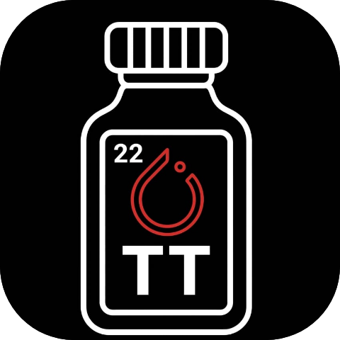
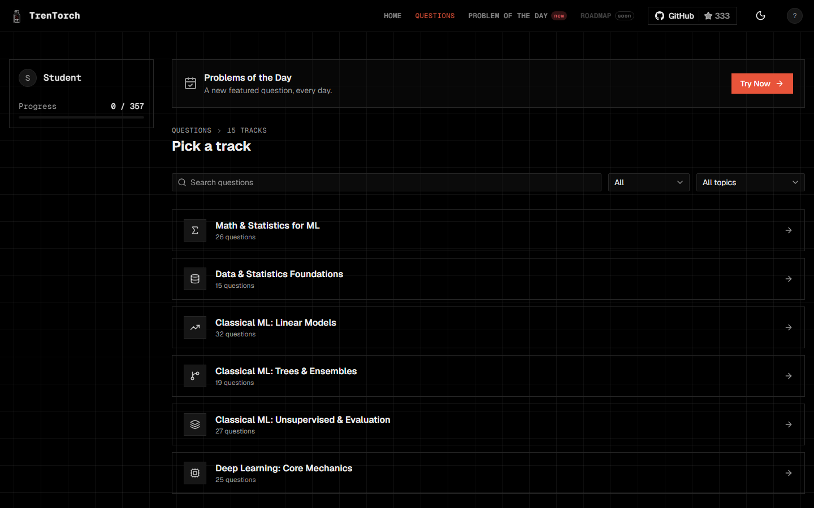
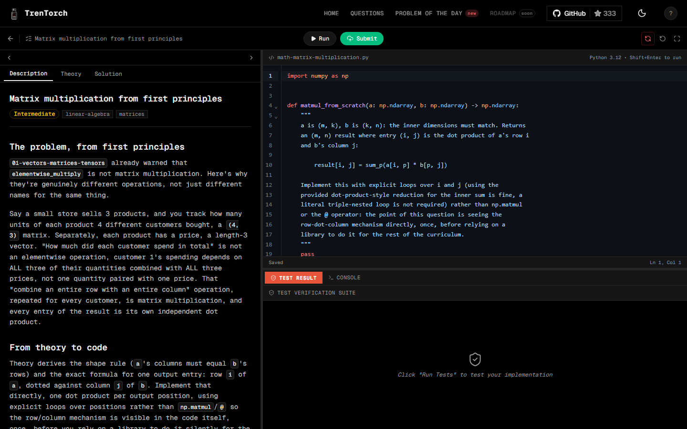

<div align="center">



# TrenTorch

**Learn ML by building it: a from-scratch machine learning framework in NumPy, and hundreds of coding questions that run in your browser.**

[](https://github.com/TrenTorch/TrenTorch/actions/workflows/validate.yml)
[](#team-engineers)
[](https://www.codefactor.io/repository/github/trentorch/trentorch)
[](https://python.org)
[](LICENSE)

[Try it in the browser](https://trentorch.com) · [Quickstart](#quickstart) · [Curriculum](#curriculum) · [Contributing](#contributing) · [FAQ](#faq)

<p>
  
  
</p>

</div>

---

> [!NOTE]
> The CLI curriculum is our implementation of [TinyTorch](https://mlsysbook.ai/tinytorch) (Harvard CS249r), rebuilt and extended in our own style. The browser version is our own, built independently.

## Quickstart

**In the browser:** open [trentorch.com](https://trentorch.com), sign in with GitHub, Google, or email, and start a question. Nothing to install. Python runs in your browser (Pyodide) and your code is graded instantly.

**In your terminal:**

```bash
git clone https://github.com/TrenTorch/TrenTorch.git
cd TrenTorch/TrenTorch_CLI
python3 -m venv .venv && source .venv/bin/activate
pip install -r requirements.txt && pip install -e .
tren setup
tren module start 01
```

<details>
<summary>Windows (PowerShell)</summary>

```powershell
git clone https://github.com/TrenTorch/TrenTorch.git
cd TrenTorch\TrenTorch_CLI
python -m venv .venv
.venv\Scripts\Activate.ps1
pip install -r requirements.txt
pip install -e .
tren setup
tren module start 01
```

</details>

`tren setup` adds `tren` to your PATH, so later terminals just need `tren`, no activating first. The [command reference](TrenTorch_CLI/docs/command-reference.md) covers the rest (`tren tui`, `tren serve`, `tren milestone`, `tren benchmark`).

<details>
<summary>Run the web app locally</summary>

```bash
cd TrenTorch_Web
npm install
npm run dev
```

Sign-in uses Supabase. Copy `.env.example` to `.env` and fill in your own project keys to use it locally.

| Command | What it does |
|---|---|
| `npm run check` | Type check |
| `npm run lint` | Prettier and ESLint |
| `npm run test` | Unit tests (Vitest) |
| `npm run test:pyodide` | Runs every question's reference solution and tests in a real Pyodide |
| `npm run build` | Production build (fully prerendered) |

</details>

## Why build it yourself

Most people learn ML frameworks by importing them. We wanted to know how they work, so we built one. Every operation traces back to raw NumPy, the architecture matches what production frameworks use, and there is no `import torch` anywhere in the curriculum. You know what `loss.backward()` does because you wrote it.

## Curriculum

The same ground, two ways:

| | [TrenTorch Web](https://trentorch.com) | TrenTorch CLI |
|---|---|---|
| **Where** | Your browser | Your terminal and Jupyter |
| **What** | 350+ coding questions in 12 topic areas | 20 modules that build a framework, from tensors to a capstone |
| **Progress** | Saved to your account | Saved locally under `user_data/` |
| **Code** | [`TrenTorch_Web/`](TrenTorch_Web) (SvelteKit) | [`TrenTorch_CLI/`](TrenTorch_CLI) (Python) |

A **Problem of the Day** features one new web question every day.

<details>
<summary>Web: 12 topic areas and their tracks</summary>

Every question has a problem statement, a theory section, a starter file, tests, and a reference solution.

| Area | Tracks |
|---|---|
| Math and statistics | Linear algebra, calculus, probability, information theory, data preprocessing, exploratory analysis, statistical inference |
| Classical ML | Linear regression, classification, decision trees, regularized models, ensembles, SVMs, instance-based and probabilistic models, unsupervised learning, evaluation, tabular foundation models |
| Deep learning core | Tensors, activations, losses, autograd |
| Training | Optimizers, layers, the training loop, regularization, why deep networks work |
| Sequence modeling | Tokenization, embeddings, recurrent networks, attention |
| Transformers and LLMs | The transformer block, modern architectures, language model assembly, LLM engineering |
| Inference | Attention mechanisms, KV cache and decoding, quantization, batching and serving metrics |
| Vision | Convolutions, pooling, CNN architecture and history, modern CNN concepts, vision transformers |
| Systems performance | Profiling, quantization, mixed-precision training, compression, acceleration, kernels |
| Distributed systems | Memoization, parallelism |
| RL and alignment | Reinforcement learning, post-training alignment, fine-tuning, benchmarking and a capstone |
| Production ML | Experiment tracking and versioning, deployment and serving, monitoring and drift |

</details>

<details>
<summary>CLI: 20 modules</summary>

| Part | Modules | What you build |
|---|---|---|
| I. Foundations | 01-08 | Tensors, activations, layers, losses, dataloader, autograd, optimizers, training |
| II. Vision | 09 | Conv2d, CNNs for image classification |
| III. Language | 10-13 | Tokenization, embeddings, attention, transformers |
| IV. Optimization | 14-20 | Profiling, quantization, compression, acceleration, memoization, benchmarking, capstone |

</details>

<details>
<summary>CLI: historical milestones</summary>

As you progress, you unlock recreations of landmark ML results, run on your own framework:

| Year | Milestone | What you reproduce |
|---|---|---|
| 1958 | Perceptron | Binary classification with gradient descent |
| 1969 | XOR Crisis | Multi-layer networks solving non-linear problems |
| 1986 | Backpropagation | Multi-layer network training |
| 1998 | CNN Revolution | Image classification with convolutions |
| 2017 | Transformer Era | Language generation with self-attention |
| 2018+ | MLPerf | Production-grade optimization |

</details>

<details>
<summary>Repository structure</summary>

```text
TrenTorch/
├── TrenTorch_CLI/                 # The `tren` CLI and the framework curriculum
│   ├── data/
│   │   ├── src/                       # Curriculum source (edit here), 01_tensor to 20_capstone
│   │   ├── modules/                   # Generated notebooks (student-facing, stubs only)
│   │   ├── solutions/                 # Reference implementations (maintainer and CI only)
│   │   ├── datasets/                  # Small training datasets
│   │   ├── milestones/                # Historical ML recreations
│   │   └── trentorch/                 # Generated package you import from
│   ├── platforms/
│   │   ├── cli/                       # The `tren` CLI
│   │   │   ├── core/                      # Config, console, theme, runtime
│   │   │   ├── cli_platform/              # Setup, system, package and dev commands
│   │   │   ├── processes/                 # Module workflow, milestone, benchmark, olympics, convert
│   │   │   ├── tui/                       # Terminal dashboard
│   │   │   ├── server/, companion_ui/     # Local companion web UI
│   │   │   └── tests/
│   │   └── dev_tools/                 # Maintainer scripts
│   ├── docs/                          # Command reference, design notes, contributing guide
│   ├── user_data/                     # Your progress and benchmarks (not committed)
│   └── tests/                         # Integration, end-to-end and environment tests
│
├── TrenTorch_Web/                 # The browser version (SvelteKit, trentorch.com)
│   ├── platform/                      # Routes, components, assets
│   ├── processes/                     # Question runner, IDE content, POTD, auth, progress
│   ├── data/                          # Curriculum, question content (app_data/), POTD schedule
│   ├── pyodide-check/                 # Runs every question in Pyodide as a repo check
│   ├── e2e/                           # End-to-end and build-output checks
│   ├── supabase/migrations/           # Auth and user-data schema, with RLS policies
│   └── docs/                          # Design specs and plans
│
└── .github/                       # CI, bots and shared assets
```

The CLI workflow: `TrenTorch_CLI/data/src/*.py` becomes `TrenTorch_CLI/data/modules/*.ipynb` (you solve it), and your solutions end up in `TrenTorch_CLI/data/trentorch/*.py`.

</details>

## Contributing

Issues and pull requests are welcome. Start with the [contributing guide](TrenTorch_CLI/docs/CONTRIBUTING.md): open an issue first, and ask to be assigned before you start on it. CI has to be green and one review from someone other than the author is required to merge. The first-contribution bot greets you on your first PR. Code quality is tracked on [CodeFactor](https://www.codefactor.io/repository/github/trentorch/trentorch), where the repository is graded A+.

Found a security problem? Do not open a public issue. Read [SECURITY.md](SECURITY.md).

---

## Team Engineers

The maintainers. Counts are recomputed whenever a PR merges, from real issue/PR activity via [`.github/workflows/update-contributors.yml`](.github/workflows/update-contributors.yml).

<table width="100%" style="width:100%">
  <tbody>
    <tr>
      <td align="center" valign="top" width="25.0%">
        <a href="https://github.com/Shashank-Tripathi-07"></a>
        <br />
        <b>Rocky</b>
        <br />
        <sub><strong>Principal Maintainer</strong></sub>
        <br />
        <sub>IIT Guwahati, Debugs autograd for fun, ships before sunrise.</sub>
        <br />
        <sub>Issues: 12 &middot; PRs: 166</sub>
      </td>
      <td align="center" valign="top" width="25.0%">
        <a href="https://github.com/maanas1234"></a>
        <br />
        <b>maanas1234</b>
        <br />
        <sub><strong>Maintainer</strong></sub>
        <br />
        <sub>Catches bugs, builds solutions and ships products</sub>
        <br />
        <sub>Issues: 13 &middot; PRs: 14</sub>
      </td>
      <td align="center" valign="top" width="25.0%">
        <a href="https://github.com/aadityansha06"></a>
        <br />
        <b>Aadityansha</b>
        <br />
        <sub><strong>Maintainer</strong></sub>
        <br />
        <sub>Reducing CPU stalls, one commit at a time.</sub>
        <br />
        <sub>Issues: 0 &middot; PRs: 4</sub>
      </td>
      <td align="center" valign="top" width="25.0%">
        <a href="https://github.com/ShivtejG236"></a>
        <br />
        <b>Shivtej Gaikwad</b>
        <br />
        <sub><strong>Maintainer</strong></sub>
        <br />
        <sub>IIT Guwahati. Shows up, ships, moves on to the next thing.</sub>
        <br />
        <sub>Issues: 0 &middot; PRs: 4</sub>
      </td>
    </tr>
  </tbody>
</table>

---

## Open-Source Contributors

Everyone else who has had a PR merged. Want to show up here? Get a PR merged: the first-contribution bot will say hello on your first PR, and this grid updates automatically after it merges. A closed-without-merging PR doesn't count, and neither does an issue on its own.

<details>
<summary>Show all 5 contributors</summary>

<table width="100%" style="width:100%">
  <tbody>
    <tr>
      <td align="center" valign="top" width="25.0%">
        <a href="https://github.com/bernalalexis-try"></a>
        <br />
        <b>bernalalexis-try</b>
        <br />
        <sub>Spots bugs, corrects them and contributes</sub>
        <br />
        <sub>Issues: 0 &middot; PRs: 1</sub>
      </td>
      <td align="center" valign="top" width="25.0%">
        <a href="https://github.com/JashT14"></a>
        <br />
        <b>JashT14</b>
        <br />
        <sub>Spots bugs, corrects them and contributes</sub>
        <br />
        <sub>Issues: 4 &middot; PRs: 3</sub>
      </td>
      <td align="center" valign="top" width="25.0%">
        <a href="https://github.com/lux-liang"></a>
        <br />
        <b>lux-liang</b>
        <br />
        <sub>Spots bugs, corrects them and contributes</sub>
        <br />
        <sub>Issues: 0 &middot; PRs: 1</sub>
      </td>
      <td align="center" valign="top" width="25.0%">
        <a href="https://github.com/MahekPatel-2403"></a>
        <br />
        <b>MahekPatel-2403</b>
        <br />
        <sub>Spots bugs, corrects them and contributes</sub>
        <br />
        <sub>Issues: 0 &middot; PRs: 1</sub>
      </td>
    </tr>
    <tr>
      <td align="center" valign="top" width="25.0%">
        <a href="https://github.com/pushkarkumarvats"></a>
        <br />
        <b>pushkarkumarvats</b>
        <br />
        <sub>Spots bugs, corrects them and contributes</sub>
        <br />
        <sub>Issues: 0 &middot; PRs: 1</sub>
      </td>
    </tr>
  </tbody>
</table>

</details>

---

## Credit

TrenTorch's CLI is our implementation, built on the curriculum and foundation of [TinyTorch](https://mlsysbook.ai/tinytorch), created by [Prof. Vijay Janapa Reddi](https://vijay.seas.harvard.edu) and the [ML Systems Book](https://mlsysbook.ai) community at Harvard University.

<details>
<summary>Related educational frameworks</summary>

- [tinygrad](https://github.com/tinygrad/tinygrad): George Hotz's minimalist framework
- [micrograd](https://github.com/karpathy/micrograd): Andrej Karpathy's tiny autograd
- [MiniTorch](https://minitorch.github.io/): Cornell's educational framework

</details>

## License

[PolyForm Noncommercial License 1.0.0](LICENSE): free for personal, educational, and noncommercial use. Not licensed for commercial use.

## Code of Conduct

This project follows the [Contributor Covenant](CODE_OF_CONDUCT.md). It applies in issues, pull requests, discussions, and on [trentorch.com](https://trentorch.com).

## FAQ

<details>
<summary>Is TrenTorch free?</summary>

Yes, for personal, educational, and noncommercial use, under the [PolyForm Noncommercial License 1.0.0](LICENSE). Commercial use is not covered. If you want to use it in a paid course or inside a company, get in touch at [rocky@trentorch.com](mailto:rocky@trentorch.com) or through [trentorch.com/contact](https://trentorch.com/contact).

</details>

<details>
<summary>Web or CLI: which should I start with?</summary>

Start with the web app if you want to try questions right now with nothing to install. Use the CLI if you want to build the framework yourself, module by module, in notebooks on your own machine. They cover the same ground, and progress is not shared between them.

</details>

<details>
<summary>Do I need a GPU, PyTorch, or TensorFlow?</summary>

No. Everything runs on the CPU with NumPy, and the curriculum never imports PyTorch or TensorFlow. The CLI needs Python 3.10 or newer. The web app runs Python 3.12 inside your browser.

</details>

<details>
<summary>Where does my code run on the web app?</summary>

In your browser, using Pyodide (Python compiled to WebAssembly). Running and grading a question does not need a server. Your progress (which questions you have solved) is saved to your account, which you create by signing in with GitHub, Google, or an email link.

</details>

<details>
<summary>How is this different from TinyTorch?</summary>

The CLI curriculum is our own implementation of [TinyTorch](https://mlsysbook.ai/tinytorch) from Harvard's CS249r: same foundation, rebuilt and extended in our style. The web app is a separate, independent project built on its own question bank.

</details>

<details>
<summary>How do I add or fix a question?</summary>

Open an issue first and ask to be assigned, as described in the [contributing guide](TrenTorch_CLI/docs/CONTRIBUTING.md). Web questions are plain files under `TrenTorch_Web/data/app_data/`, and the [authoring guide](TrenTorch_Web/data/app_data/README.md) explains the layout. CLI modules are edited in `TrenTorch_CLI/data/src/`.

</details>

<details>
<summary>How do I get listed under Open-Source Contributors?</summary>

Get a pull request merged. A workflow updates the grid automatically after each merge. A closed-without-merging PR does not count, and neither does an issue on its own.

</details>

<details>
<summary>I found a bug. Where do I report it?</summary>

Open a [GitHub issue](https://github.com/TrenTorch/TrenTorch/issues) with steps to reproduce. For a security problem, do not open a public issue: follow [SECURITY.md](SECURITY.md).

</details>

---

<div align="center">

<b>Build it yourself. Understand it fully.</b>

</div>
