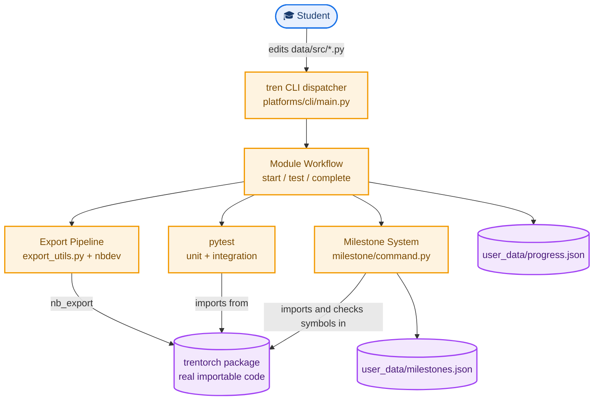

# TrenTorch: System Design

*This document describes how the `tren` CLI and the TrenTorch course pipeline actually work: what happens between a student editing a module and that module becoming a real, importable, gradable piece of the `trentorch` package. It is written for a contributor who needs to change the export pipeline or the milestone system, not for a student. Read [`design.md`](design.md) first for the pedagogical framing; this document only covers mechanics. Sourced from `platforms/cli/` and `pyproject.toml`; the upstream `.github/workflows/tinytorch-validate-dev.yml` this was originally cross-checked against doesn't exist in this fork (see [`design.md`](design.md#cicd-upstream-only-not-present-in-this-fork)). This fork previously carried a progress-sync path that talked to the upstream project's own hosted backend; it has since been removed (see [`design.md`](design.md#community-dashboard-and-progress-sync-removed)), and this document no longer describes it.*

## 1. Problem this system solves

A student's work has to move through three representations before it counts as complete: a notebook they edit interactively, a plain Python module the test suite and export tooling can process programmatically, and finally a real symbol inside the installed `trentorch` package that later modules and milestones can import. Each of those representations has to stay consistent with the other two, and a student needs a single command that handles the whole conversion without them ever touching `nbdev` or `jupytext` directly. `tren` is that command.

## 2. Dependencies and what each one actually does here

| Dependency | Role in this codebase |
|---|---|
| `numpy>=2.2.6,<3.0.0` | The tensor backend. `data/trentorch/core/tensor.py` wraps numpy arrays directly, this is the actual math, not a convenience layer. |
| `rich>=15.0.0` | All CLI console output. `platforms/cli/core/console.py` builds every panel, table, and progress indicator a student sees. |
| `PyYAML>=6.0.3` | Parses per-module `module.yaml` config (read by `platforms/cli/core/modules.py`) and, as a fallback path that finds no files in the current repo layout, `MilestoneSystem._load_milestones_config` (`platforms/cli/processes/milestone/system.py`) still looks for `data/milestones/milestones.yml` and per-era `milestone.yml` files that don't exist here &mdash; the milestone data that's actually live comes from the hardcoded `MILESTONE_SCRIPTS`/`MILESTONE_ALIASES` constants in `milestone/constants.py` instead. |
| `pytest>=8.0.0` | Runs as a subprocess for module-level and integration tests, and is the underlying runner CI drives through `tren dev test`. |
| `nbdev>=3.0.15,<3.0.16` (dev group) | Does the actual export: turns notebook cells into real files inside the `data/trentorch/` package. Called in-process via `nbdev.export.nb_export`, not as a subprocess. |
| `jupytext>=1.19.3` (dev group) | Converts a module's plain-Python dev file into the `.ipynb` a student opens in Jupyter, run as a subprocess. |

One dependency direction is worth stating precisely: `tren` depends on the `trentorch` project tree (reads and writes `data/src/`, `data/modules/`, `data/milestones/<NN>_<name>/`, `user_data/progress.json`) and, in exactly one place, imports the generated `trentorch` package itself to confirm an export actually produced a real, working symbol rather than an empty file. The `trentorch` package has no dependency on `tren` at all. It is a plain importable library once exported.

## 3. Full system diagram



Orange boxes are code the CLI runs directly. Purple cylinders are things written to disk or to the generated package. Earlier versions of this diagram included a progress-sync path to an external community dashboard; that code has since been removed (see [`design.md`](design.md#community-dashboard-and-progress-sync-removed)).

## 4. Component inventory

```
                              tren (console script)
                                     |
                    platforms/cli/main.py: TrenTorchCLI
                     dict-based command registry, one
                     BaseCommand subclass per subcommand
                                     |
     +----------+----------+--------+--------+-----------+
     |          |          |                 |           |
   TUI/serve  Module   Milestone      Dev/CI tools    Package
              workflow   system       (test --ci)     commands
   (start/test/
    complete/reset)
        |
        v
  export_utils.py (shared: discover_modules, convert_py_to_notebook,
                    validate_notebook_integrity)
```

The four components that matter most for a system-design understanding:

- **The `tren` dispatcher** (`platforms/cli/main.py`). A literal dict maps subcommand strings to command classes. There is no plugin discovery mechanism, adding a command means adding an entry to this dict.
- **The module workflow subsystem** (`platforms/cli/processes/module_workflow/workflow.py`, close to 1370 lines). Owns the full lifecycle of one module: `start`, `view`, `resume`, `test`, `complete`, `reset`.
- **The export pipeline** (`platforms/cli/commands/export_utils.py`), shared logic the module workflow calls into rather than owning itself.
- **The milestone system** (`platforms/cli/processes/milestone/`, split across `command.py`/`system.py`/`display.py`/`constants.py`), which gates on completed modules.

## 5. Data flow: from a student's edit to a real symbol

```
1. Student edits data/modules/XX_module/XX_module.ipynb
   (converted from data/src/XX_module/XX_module.py, which uses
   percent-format Python cell markers, #| export / #| default_exp)
                    |
2. tren module complete NN
                    |
3. run_inline_unit_tests(config, console, module_name)
   runs the notebook's own inline tests in-process
                    |
4. check_notebook_syntax(config, module_name)
   validates the notebook before export proceeds
                    |
5. export_module(module_name)
   reads data/modules/<module>/<name>.ipynb
   nb_export(notebook, lib_path=data/trentorch/)
   -> writes a real file, e.g. data/trentorch/core/tensor.py
                    |
6. run_integration_tests(config, console, module_name)
   pytest against data/src/XX_module/tests/, importing from
   the trentorch package just written
                    |
7. update_progress(module_num, module_name)
   writes user_data/progress.json
                    |
8. check_and_run_milestone_unlocks (platforms/cli/processes/milestone/system.py)
   writes user_data/milestones.json, and runs the milestone immediately
   if this module completion was the last prerequisite for one
```

Three steps are easy to miss and worth calling out directly. First, `tren module test <NN>` alone does not run step 5 (it's a separate command with its own, four-phase flow that never exports, see [`command-reference.md`](command-reference.md#tren-module-primary-student-workflow)); only `tren module complete <NN>` exports anything, a common point of confusion for a student who assumes testing and completing are the same action. Second, the milestone check does not just look at whether the export step reported success, it separately imports the just-exported module and checks that specific required symbols actually exist, since a file existing and a file containing working code are not the same guarantee. Third, step 8 doesn't just unlock a milestone, it runs it in the same flow (`check_and_run_milestone_unlocks` calls straight into the milestone `run` handler) rather than telling the student to run it separately.

## 6. Error handling

```
TrenTorchCLIError (base, platforms/cli/core/exceptions.py)
    |
    +-- ValidationError
    +-- ExecutionError
    +-- EnvironmentError
    +-- ModuleNotFoundError
```

The class is still named `TrenTorchCLIError`, not `TrenTorchCLIError` &mdash; that's the actual current name in code, not a leftover this doc should paper over. The top-level `run()` loop catches `KeyboardInterrupt` (exits 130), catches `TrenTorchCLIError` and its subclasses for a clean, formatted error panel, and catches bare `Exception` as a last resort, logged as an unexpected error rather than surfaced as a normal CLI failure. This distinction matters for debugging: a `TrenTorchCLIError` is a condition the code anticipated and has a good message for, a bare exception is something nobody planned for.

The export pipeline itself does not raise on most failures, it returns structured results instead. `validate_notebook_integrity` returns a dict with `valid`, `issues`, `warnings`, and `stats` rather than throwing, and `export_module` catches both a missing-nbdev `ImportError` (with a specific "run `pip install nbdev`" message) and any other exception, returning an integer status rather than propagating.

## 7. Known coupling worth understanding before you change anything

The module registry (`platforms/cli/core/modules.py`) is the single place that maps a module number to a module name, and it is read by the export pipeline, the milestone system's required-modules check, and (per the module docstrings) grading tooling. A change to module numbering has to go through this one file, not be patched independently in each consumer.

The milestone unlock check is not a passive read of the progress file. It actively imports the freshly exported module and checks named attributes exist, which means a milestone can correctly report a module as "exported but not actually working" rather than trusting file existence alone. Any refactor of the export pipeline that changes where a symbol lands needs to be checked against this specific validation, not just against the export step's own success/failure return value.

## 8. Contributing

If you are changing the export pipeline, run the full chain by hand at least once, edit a real module's dev file, run `tren module complete`, and confirm the resulting file in `data/trentorch/` both exists and contains the symbols the milestone system expects. A passing `test_static.py`-equivalent check is not sufficient proof the export actually worked end to end.
